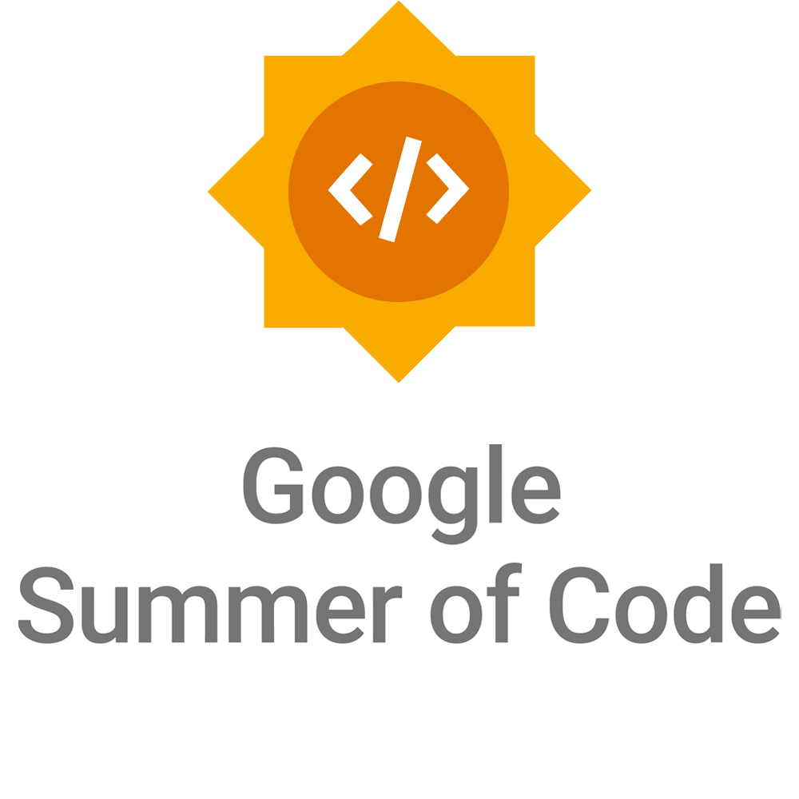

# 

Gojek is proud to apply for Google Summer of Code 2026 for the first time as a mentoring open source organization, joining the global effort to nurture the next generation of open source contributors. See [official Google Summer of Code site](https://summerofcode.withgoogle.com/).

Gojek offers an exciting opportunity to spend your summer learning, building, and contributing to MQTT-focused open-source projects. Our work spans a wide range of technologies, from mobile platforms such as Kotlin, Java, Android, iOS, Swift, Flutter, etc. to backend systems including but not limited to Erlang, Golang, and HAProxy. With a vibrant open-source culture and an active community of maintainers and mentors, Gojek is a great place to grow as an engineer. We look forward to your applications and the innovative project ideas you bring with you.

And remember, we are always open to new ideas, just reach out to us on [https://gojek.discord.com/channels/google-summer-of-code-2026](https://discord.com/channels/986889666651373568/1468219617066356807)!

| GSoC Season  |  Information |
|-------|--------------|
| 2026| [Google Summer of Code 2026](google-summer-of-code-2026.md) |